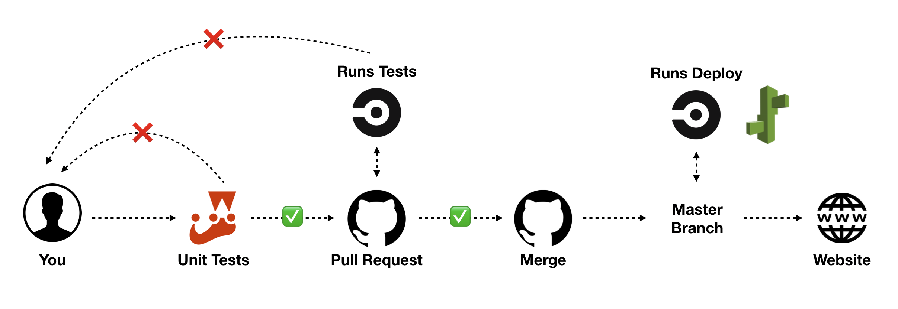

# Amathon 2019 with CircleCI & Elastic Beanstalk

2019 Amathon 사전 세션에 오신 것을 환영합니다 🙌 

오늘 핸즈온 주제는 **CircleCI + ElasticBeanstalk을 활용한 React 배포 자동화**입니다. 세션을 시작하기 앞서 몇 가지 **필수 준비사항**들이 있습니다. 세션 시작 전 아래 **필수 준비사항**들을 준비 후 세션에 참석해주세요.

 

### 🙃 필수 준비 사항

- #### ⛑ 환경 세팅하기: [README](./guide/BeforeSession.md)

- #### 🐙 Git with Gitkraken: [README](./guide/Git.md)

 

### 😎 세션 시작하기

- #### 🔨 React + Express App 개발하기 Part 1: [Go](./guide/ReactExpress.md)

- #### 🛠 React + Express App 개발하기 Part 2: [Go](./guide/ReactExpress_2.md)

- #### ✅ CircleCI 설정하기: [Go](./guide/CircleCI.md)

- #### 🌱 Elastic Beanstalk 설정하기: [Go](./guide/ElasticBeanstalk.md)

 

### 🤑 삭제 가이드

- #### ⏹ 과금 방지를 위한 삭제 가이드: [Go](./guide/Delete.md)

세션 자료 검토 및 서포트헤주신 **AUSG 3기 문성혁님, 이은규님, 신동선님, 김병규님** 감사합니다 😍