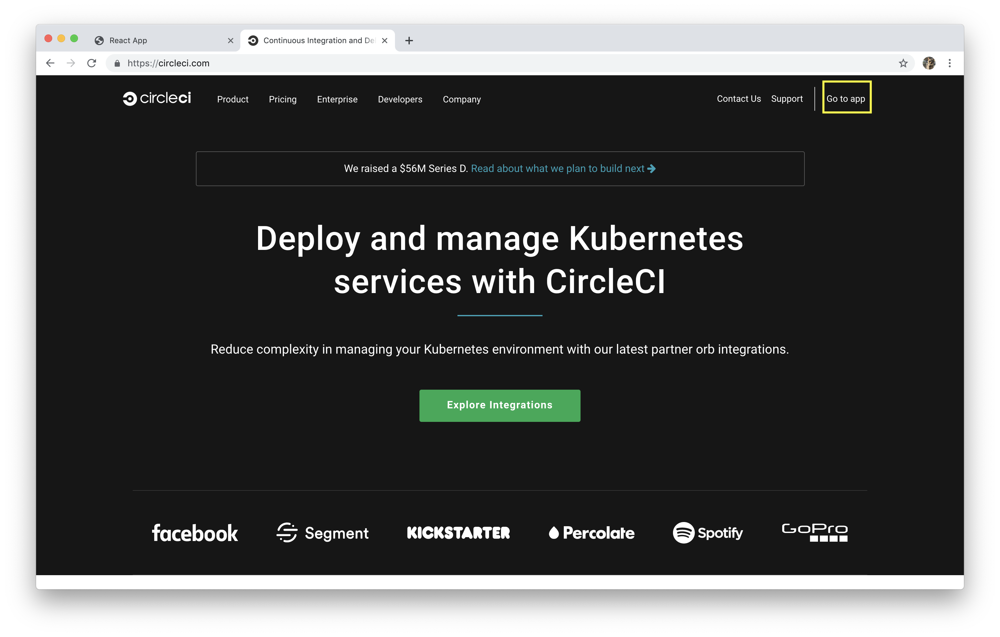
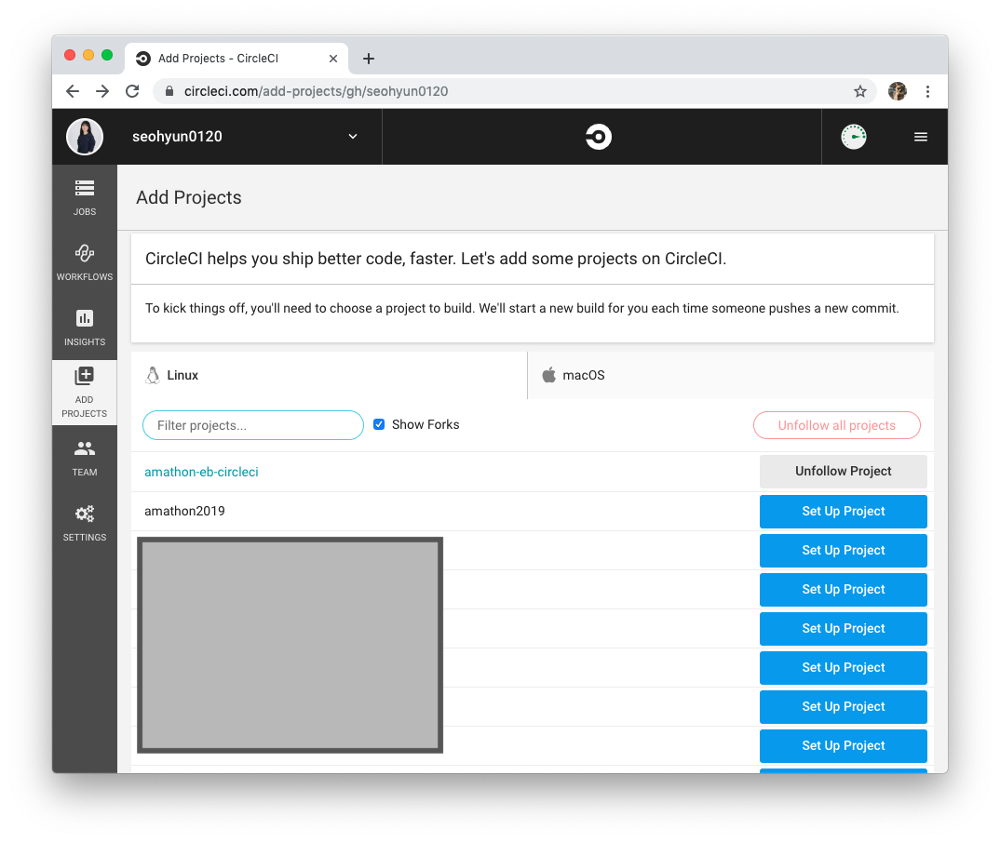
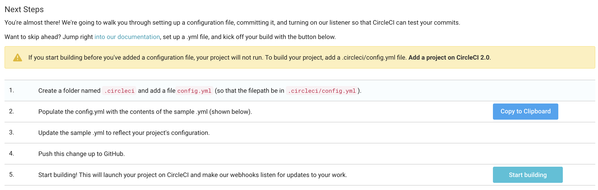
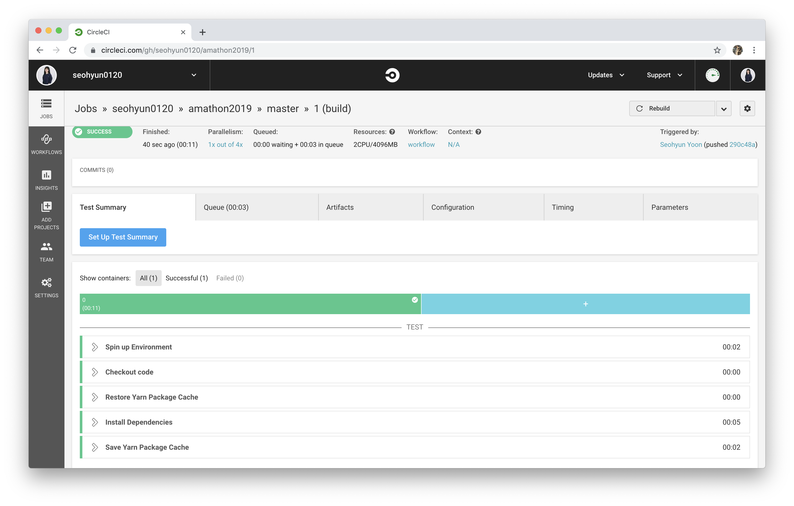

# CircleCI

CircleCI 로그인 후, 상단에 **Go to app**을 클릭해주세요.



<br>

## 0️⃣ Add Project

왼쪽 메뉴중, **ADD PROJECTS** 버튼을 클릭해보세요. 그럼 현재 연결된 github 계정의 repository들이 나열된 것을 확인할 수 있습니다. 현재 진행중인 repo를 선택해 **Set Up Project** 버튼을 눌러주세요.



<br>

## 1️⃣ IAM User 등록하기

왼쪽 메뉴중 **JOBS** 버튼을 선택한 후, 해당 프로젝트에 **톱니바퀴 아이콘**을 눌러봅시다.




**PERMISSIONS**에서 **AWS Permissions** 를 클릭한 후, 이 프로젝트를 위해 생성했던 IAM User의 엑세스 키와 비밀 엑세스 키를 입력해주세요. csv파일로 다운받지 않았다면, `~/.aws/credentials` 에서 확인할 수 있습니다.


<br>

## 2️⃣ config.yml 생성

**.circleci 폴더** 아래 **config.yml** 파일을 만든 후, 아래 코드를 복사 붙여넣기 해주세요.

### 🐈 Yarn 사용자

```
version: 2
jobs:
  build:
    docker:
      - image: circleci/node:8.10
    working_directory: ~/amathon2019
    steps:
      - checkout
      - restore_cache:
          name: Restore Yarn Package Cache
          keys:
            - yarn-packages-{{ checksum "yarn.lock" }}
      - run:
          name: Install Dependencies
          command: yarn install --frozen-lockfile
      - save_cache:
          name: Save Yarn Package Cache
          key: yarn-packages-{{ checksum "yarn.lock" }}
          paths:
            - ~/.cache/yarn
      - run:
          name: Install Dependencies && Build Client
          command: |
            cd client
            yarn
            yarn build
```


### Ⓜ️ NPM 사용자

```
version: 2
jobs:
  build:
    docker:
      - image: circleci/node:8.10
    working_directory: ~/amathon2019
    steps:
      - checkout
      - restore_cache:
          key: dependency-cache-{{ checksum "package.json" }}
      - run:
          name: install-npm-wee
          command: npm install
      - save_cache:
          key: dependency-cache-{{ checksum "package.json" }}
          paths:
            - ./node_modules
      - run:
          name: Install Dependencies && Build Client
          command: |
            cd client
            npm
            npm build
```


### 🤙 Jobs

> circleci는 1개 이상의 job을 수행합니다. 수행할 작업은 모두 `jobs`에서 정의되어야합니다.

- **docker**

  circleci 2.X 버전의 장점은 `docker`를 natvie로 지원하는 점입니다. 우리의 프로젝트는 node 8.10 버전에서 실행중이므로, 다음과 같이 작성해주세요. 혹시나 8.10가 아닌 다른 버전을 사용중일 경우, [여기](https://hub.docker.com/u/circleci) 에서 본인이 해당하는 버전을 찾아 작성해주세요.


- **working_directory**

  현재 디렉토리의 경로를 입력해주세요. 저는 **'amathon2019'** 이라는 폴더 아래에서 진행중입니다!


- **steps**

  앞서 우리가 docker image로 사용한 **circleci/node:8.10**에는 **Yarn**이 미리 설치되어있기에 **Yarn** 설치과정은 생략해도 됩니다.

  매번 commit 할 때마다 패키지들을 설치하면 매우 비효율적이겠죠? build 시간을 단축시키기 위해 패키지들을 캐싱하도록 합시다. 

  Yarn 패키지 캐시 복원 ➡️ Dependecies 설치 ➡️ Yarn 패키지 캐시 저장 ➡️ Build React App 

<br>

## 3️⃣ commit & push

지금까지의 변경사항을 **commit** 한 후 **push** 해주세요. **Start Building** 버튼을 눌러주세요.



다음과 같이 **'SUCCESS'** 가 뜬 것을 확인할 수 있습니다. 

<br>

기본적인 **circleci** 세팅은 완료되었습니다. 이제, **Elastic Beanstalk**을 활용해 우리가 만든 react app을 **어떻게 배포할 것인지**에 알아봅시다. [다음 가이드로 이동하기](./ElasticBeanstalk.md)

