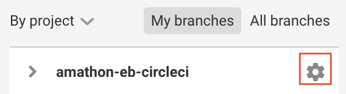
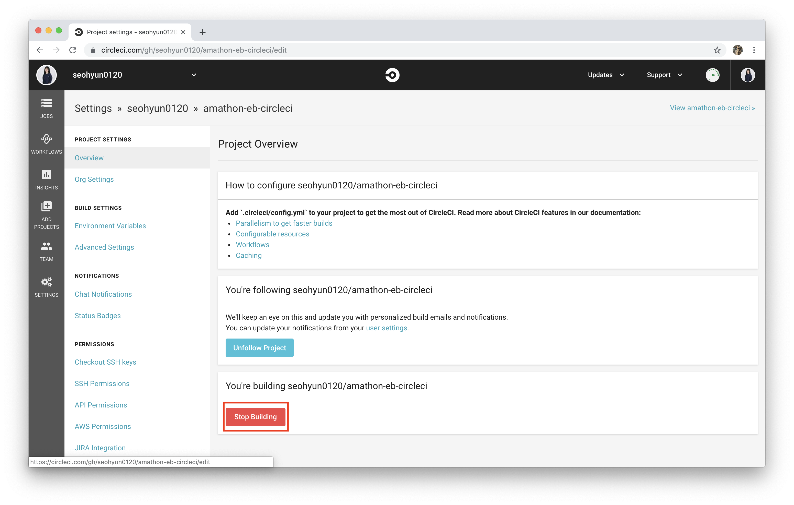

# 삭제 가이드

해당 세션의 **가장 중요한 부분**! 바로 **과금 방지**입니다. 세션 진행에 사용되었던 리소스들을 삭제하는 방법에 대해 알아보도록 합시다.

 

## 0️⃣ CircleCI 연동 종료

본인의 circleci 대시보드에서 해당 프로젝트를 선택한 후, 설정을 눌러주세요.

 

아래에 **Stop Building** 버튼을 눌러, CircleCI와의 연동을 종료해주세요.

 

## 1️⃣ EB 종료하기

