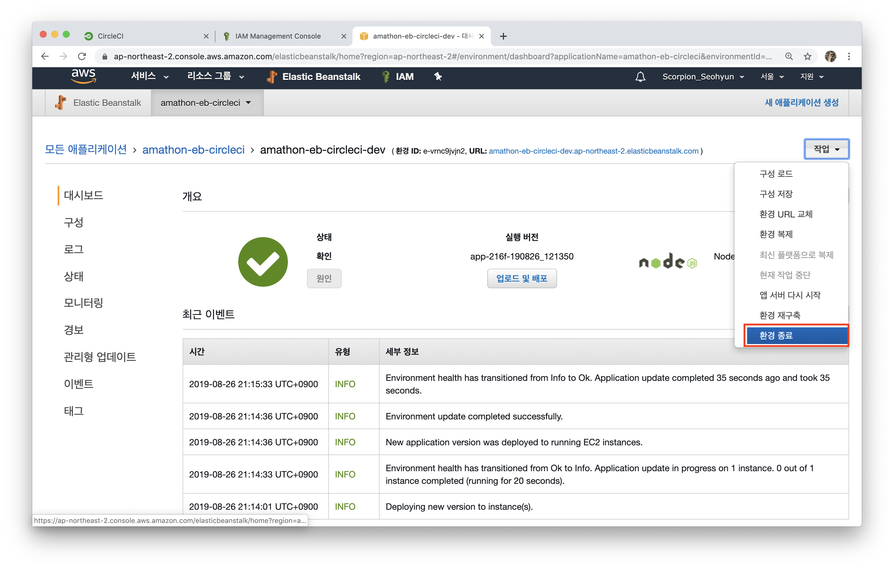
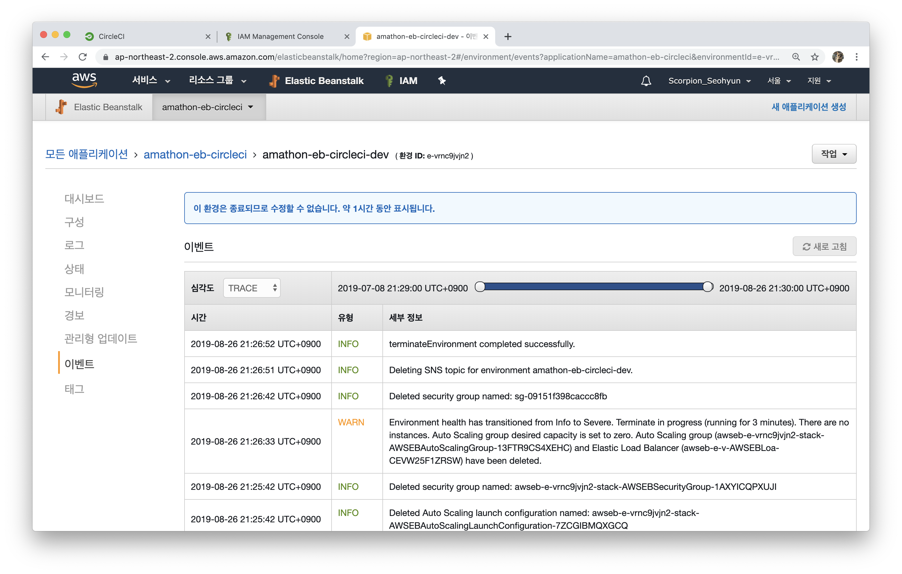
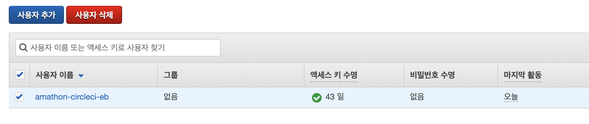

# 삭제 가이드

해당 세션의 **가장 중요한 부분**! 바로 **과금 방지**입니다. 세션 진행에 사용되었던 리소스들을 이제는 사용하지 않으니 삭제하는 방법에 대해 알아보도록 합시다.

 

## 0️⃣ CircleCI 연동 종료

본인의 circleci 대시보드에서 해당 프로젝트를 선택한 후, 설정을 눌러주세요.

 

아래에 **Stop Building** 버튼을 눌러, CircleCI와의 연동을 종료해주세요.

 

## 1️⃣ EB 종료하기

aws console에 접속한 후, **elastic beanstalk**을 선택해주세요. 세션에 사용되었던 애플리케이션을 선택한 후, 우측 상단의 **작업** 버튼을 클릭한 후, **환경 종료**를 눌러주세요.

 

아래와 같이, **이 환경은 종료되므로 수정할 수 없습니다.** 와 같은 문구를 보고 계신다면, 제대로 환경이 종료된 것이 맞습니다.

## 2️⃣ IAM 사용자 삭제하기

aws console에 접속한 후, **IAM**을 선택해주세요. 세션을 위해 생성한 IAM 사용자를 선택한 후, **사용자 삭제** 버튼을 클릭하여 사용자를 삭제해주세요. 

세션에 참석해주세서 정말 감사합니다. 

세션 자료에 있어서 궁금한 점은 **Issue**를, 수정 및 추가했으면 하는 부분들은 **Pull Request**를 남겨주세요. 언제나 환영입니다 🙌

