# ElasticBeanstalk

**AWS ElasticBeanstalk**에 이때까지 만든 애플리케이션을 배포해봅시다. 


## 0️⃣ IAM 사용자 생성하기

AWS Console에 로그인 후, 서비스에서 **IAM**을 클릭하면 다음과 같은 화면을 볼 수 있습니다. 

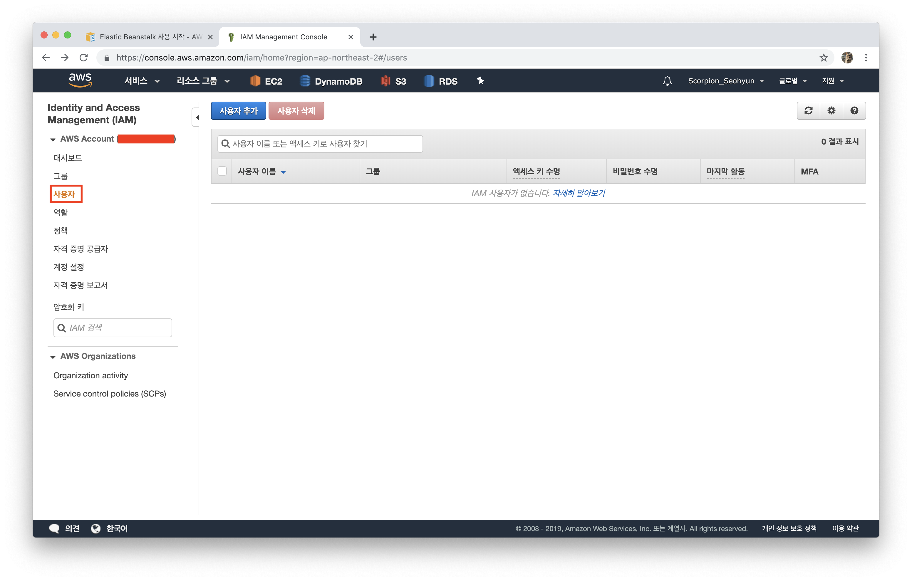

`사용자 추가`를 클릭해주세요.

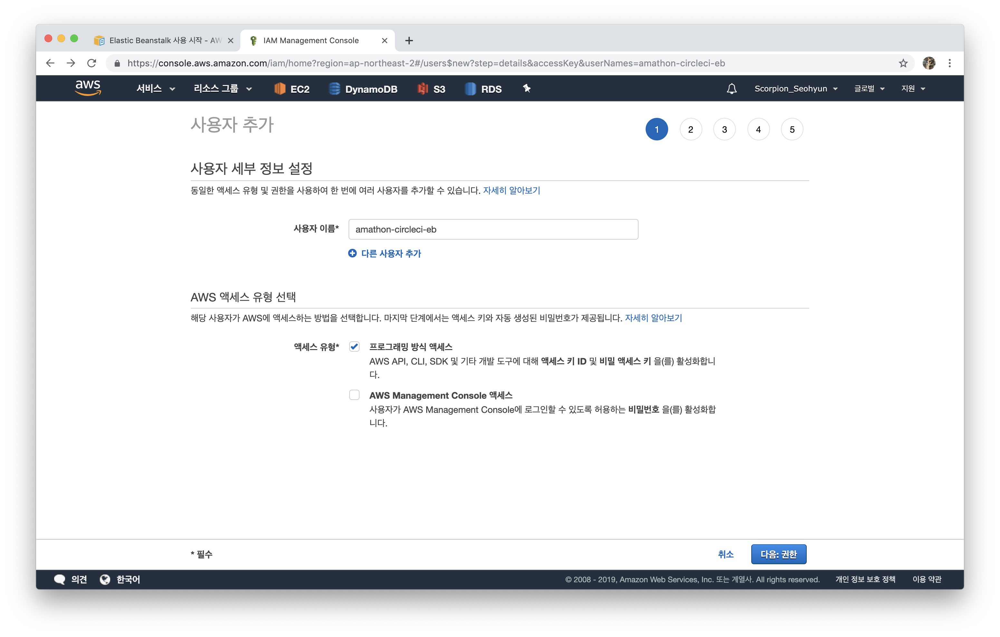

`사용자 이름`: amathon-circleci-eb 

`AWS 엑세스 유형`: 프로그래밍 방식 엑세스 선택 후 **다음**을 눌러주세요.

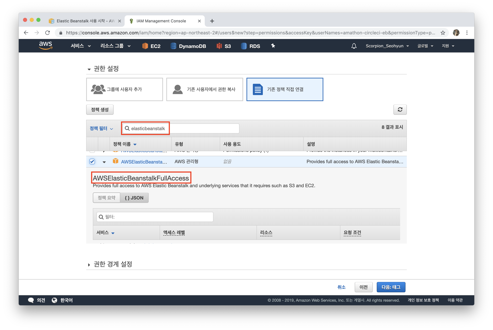

`기존 정책 직접 연결` 을 선택한 후, 검색창에 `elasticbeanstalk` 이라고 검색해주세요. 그 중, **AWSElasticBeanstalkFullAccess** 이라고 적힌 full access를 부여하도록 합시다. 그 후 **다음**을 눌러주세요. 

`태그 추가`는 넘기고, 다시 한번 제대로 설정했는지 검토한 후, `사용자 만들기` 버튼을 눌러주세요.

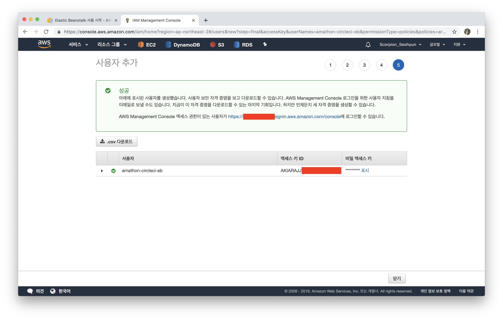

다음과 같이 사용자가 생성된 것을 확인할 수 있습니다. 


## ❇️ AWS Configure 구성하기

방금 생성한 사용자를 AWS CLI에서 사용할 수 있도록 설정해봅시다. 터미널을 열어 아래와 같이 작성해봅시다.

profile  속성을 통해 여러 계정을 switching하며 사용할 수 있도록 설정해봅시다.

```shell
$ aws configure --profile amathon
AWS Access Key ID [None]: 방금 생성된 엑세스 키 ID
AWS Secret Access Key [None]: 방금 생성된 비밀 엑세스 키
Default region name [None]: ap-northeast-2
Default output format [None]: json
```

<br>

**AWS CLI**는 `aws configure`를 사용하여 지정하는 자격 증명을 홈 디렉터리의 `.aws`라는 폴더에 있는 `credentials`라는 로컬 파일에 저장합니다. OS에 따라 저장위치가 다르니 아래를 확인해주세요.

**macOS, Linux, Unix**

```~/.aws/credentials
~/.aws/credentials
```

**Windows**

```
C:\Users\USERNAME\.aws\credentials
```

<br>

```shell
$ cd .aws
$ vim credentials
```

저처럼 **한 개 이상의 사용자**를 등록해둔 경우, 아래와 같이 확인할 수 있습니다.

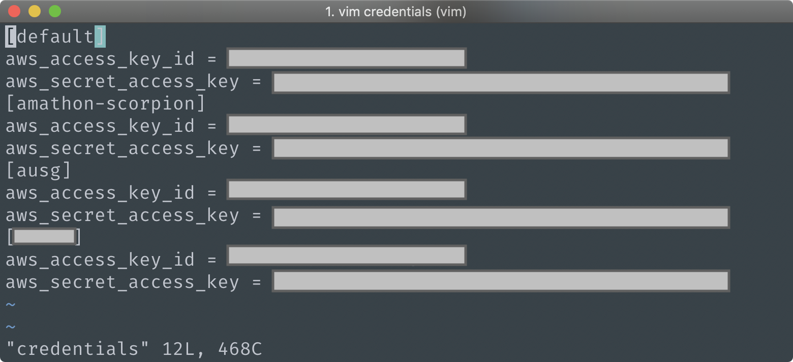

<br>

## 1️⃣ EB Init

`eb init`  명령어를 통해 EB CLI를 실행할 수 있도록 세팅해봅시다.

```shell
$ eb init --profile amathon
```

1. **Select a default region**

   우리는 ap-northeast-2(Seoul) 리전을 사용해야하므로, `10`을 입력해주세요.

2. **Enter Application Name**

   현재 디렉토리의 이름이 기본값입니다. `amathon` 이라고 입력해주세요.

3. **CodeCommit?**

   우리는 사용하지 않으므로 `N` 라고 입력해주세요.

4. **SSH Keypair**

   EB 인스턴스에 SSH key pair를 할당하기위해 `Y` 를 입력해주세요.

   `3` 을 입력한 후 `amathon-eb` 이름으로 하나 생성해주세요. 

   (저는 이미 해당 key pair가 있어서 그것을 선택하였습니다.)

<br>

위와 같이 설정하게되면, 현재 디렉토리에서 `.elasticbeanstalk` 폴더안에 `config.yml` 파일이 생성된 것을 확인할 수 있습니다. (이때 .gitignore 파일에서 생성된 elasticbeanstalk 부분을 지워주세요) 저와 똑같이 설정하셨다면, **config.yml** 파일은 다음과 같아야합니다.

**.elasticbeanstalk/config.yml**

```yml
branch-defaults:
  master:
    environment: null
    group_suffix: null
global:
  application_name: amathon
  branch: null
  default_ec2_keyname: amathon-eb
  default_platform: Node.js
  default_region: ap-northeast-2
  include_git_submodules: true
  instance_profile: null
  platform_name: null
  platform_version: null
  profile: amathon
  repository: null
  sc: git
  workspace_type: Application
```

ElasticBeanstalk은 **nodejs**로 실행되는데 우리의 server는 **ES6**으로 실행됩니다. 따라서, 우리의 server code를 **순수 nodejs 파일로 변경해줘야합니다.**

<br>

**package.json**

```
{
  ...,
  "scripts": {
    ...,
    "build": "babel server.js --out-file server.compiled.js"
  }
}
```

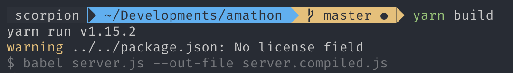

빌드를 해봅시다. `server.compiled.js`라는 파일이 생성된 것을 확인할 수 있습니다. 

<br>

EB는 우리의 nodejs  App을 `server.js`  혹은 `app.js`를 사용합니다. 하지만 우리의 컴파일 파일은 `server.compiled.js` 이기 때문에 수정을 해야합니다. 


**.ebextensions/nodecommand.config**

```config
option_settings:
  aws:elasticbeanstalk:container:nodejs:
    NodeCommand: "node server.compiled.js"
```

이제 EB는 **server.compiled.js** 로 서버를 실행할 수 있습니다. 

<br>

## 2️⃣ EB Create

EB 환경을 생성해봅시다. 

```shell
$ eb create --profile amathon
```

1. **Enter Environment Name**

   enter (default 값)

2. **Enter DNS CNAME prefix**

   enter (default 값)

3. **Select a load balancer type**

   enter (default 값)

계속 **default값**으로 설정한 후, 몇 분 정도 기다리면 **Successfully launched environment** 라는 문장과 함께 EB 환경이 생성됩니다.

<br>

```shell
$ eb status --profile amathon
```


<br>

elastic beanstalk 콘솔에서 배포된 웹사이트를 열어봅시다.

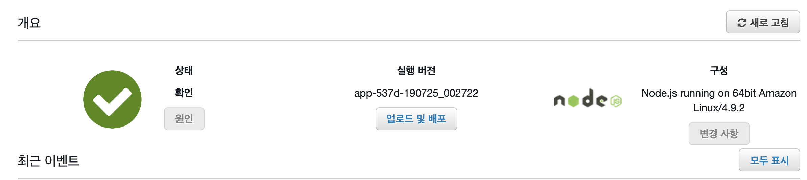

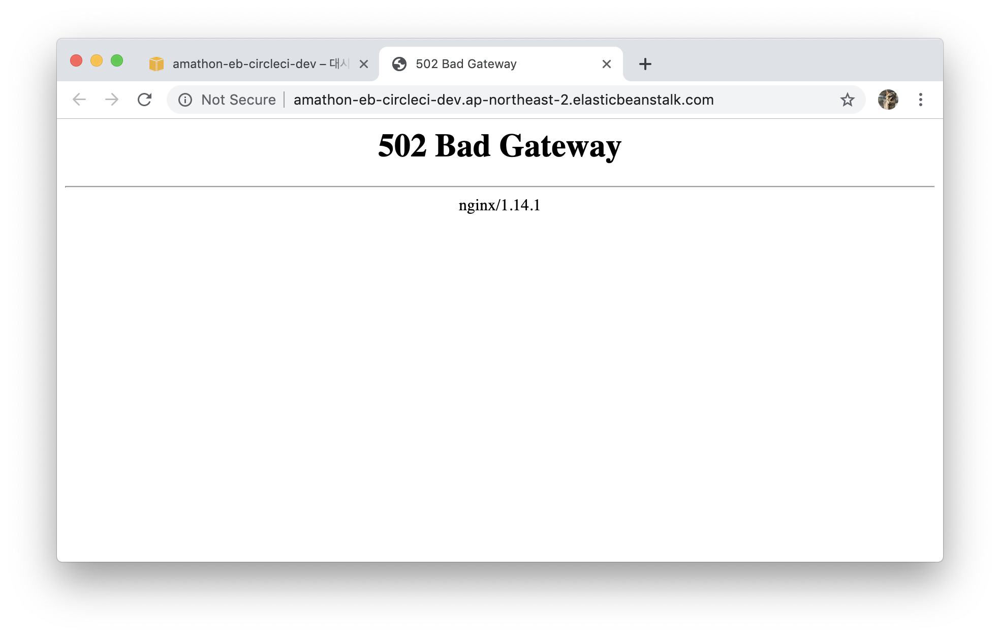

URL을 클릭해보면, **'502 Bad Gateway'**가 뜨는 것을 확인할 수 있습니다. 여기까지 오셨다면 정상적으로 배포를 완료하셨습니다. 

<br>

## 3️⃣ Proxy 설정

EB에서 Node.js 플랫폼은 역방향 프록시를 사용하여 인스턴스에서 포트 80의 요청을 포트 8081에서 수신 중인 애플리케이션으로 전달합니다. 우리의 서버는 `4001` 번 포트에서 실행되기때문에 **'502 Bad Gateway'**가 뜨는 것을 확인할 수 있습니다. 

따라서 proxy 설정을 해보도록 합시다.

```shell
$ touch .ebextensions/proxy.config
```

<br>

**.ebextensions/proxy.config**

[여기](https://docs.aws.amazon.com/ko_kr/elasticbeanstalk/latest/dg/nodejs-platform-proxy.html?source=post_page)에 적힌 코드를 복사해주시고, **8번째 줄** 포트 번호만 **'5000'**에서 **'4001'**로 바꿔주세요.

```config
upstream nodejs {
  server 127.0.0.1:4001;
  keepalive 256;
}
```

<br>

## 4️⃣ Static File 설정

위에서 작성한 파일 **37번째줄**에서 다음과 같은 코드를 볼 수 있습니다. 

**.ebextensions/proxy.config** 

```
location /static {
	alias /var/app/current/static;
}
```

우리가 nodejs 앱을 EB에 배포할 때, 모든 파일이  `/var/app/current`  디렉토리 아래에 저장됩니다. 하지만 우리의 `static` 파일은 root directory 밑이 아닌 `client/build` 아래에 위치하고있습니다.

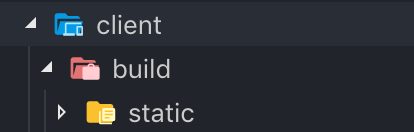

<br>

따라서, 코드를 다음과 같이 수정해주세요

**.ebextensions/proxy.config**

```
location /static {
	alias /var/app/current/client/build/static;
}
```


## 5️⃣ config.yml 설정

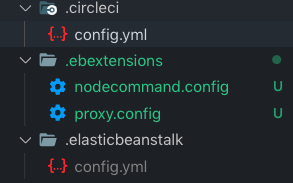

```config
version: 2
jobs:
  build:
    docker:
      - image: circleci/node:8.10
    working_directory: ~/amathon2019/client
    steps:
      - checkout
      - restore_cache:
          name: Restore Yarn Package Cache
          keys:
            - yarn-packages-{{ checksum "yarn.lock" }}
      - run:
          name: Install Dependencies
          command: yarn install --frozen-lockfile
      - save_cache:
          name: Save Yarn Package Cache
          key: yarn-packages-{{ checksum "yarn.lock" }}
          paths:
            - ~/.cache/yarn
      - run:
          name: Install Dependencies && Build Client
          command: |
            cd client
            yarn
            yarn build
  deploy:
    docker:
      - image: circleci/python:2.7
    working_directory: ~/amathon2019
    steps:
      - checkout
      - run:
          name: Install awscli
          command: |
            sudo pip install awsebcli --upgrade
      - run:
          name: Create AWS credentials manually
          command: |
            mkdir ~/.aws
            touch ~/.aws/config
            chmod 600 ~/.aws/config
            echo "[profile amathon]" > ~/.aws/config
            echo "aws_access_key_id=$AWS_ACCESS_KEY_ID" >> ~/.aws/config
            echo "aws_secret_access_key=$AWS_SECRET_ACCESS_KEY" >> ~/.aws/config
            ls
      - run:
          name: Deploy to EB if branch is Master
          command: |
            eb use amathon-dev --profile amathon
            eb deploy --profile amathon

workflows:
  version: 2
  build-deploy:
    jobs:
      - build
      - deploy:
          requires:
            - build
          filters:
            branches:
              only:
                - master
```


### 🤙 workflows

> workflow는 jobs에 정의된 모든 것을 조합하여 사용할 수 있도록 해줍니다. Workflow 또한 유일한 이름을 가지고있어야합니다.

- **<workflow_name>**

  job을 조합한 하나의 단위의 이름으로, 유일한 이름이어야합니다. 위에서는 **build-deploy** 라는 workflow를 수행합니다.

  

- **jobs**

  정의된 job들에 대한 여러가지 조건을 제시할 수 있습니다. 한가지 예를 들자면, 기본적으로 프로젝트를 build한 후, test를 통과한다면 **master** 브랜치에서 deploy를 할 수 있는 workflow를 구성할 수 있습니다. 자세한 조건들은 [여기](https://circleci.com/docs/2.0/configuration-reference/#workflows)를 참조하세요.

  master 브랜치: `build` ▶️ `test` ▶️ `deploy`

  이외의 브랜치: `build` ▶️ `test`

  

  우리가 정의한 job은 `build` 와 `deploy`가 있습니다. `master` 브랜치만 배포를 할 수 있도록 하려면, 위처럼 filters 조건을 사용하여 구성할 수 있습니다. 


## 6️⃣ commit & push

지금까지 변경사항을 **commit**한 후 **push**해보세요. 

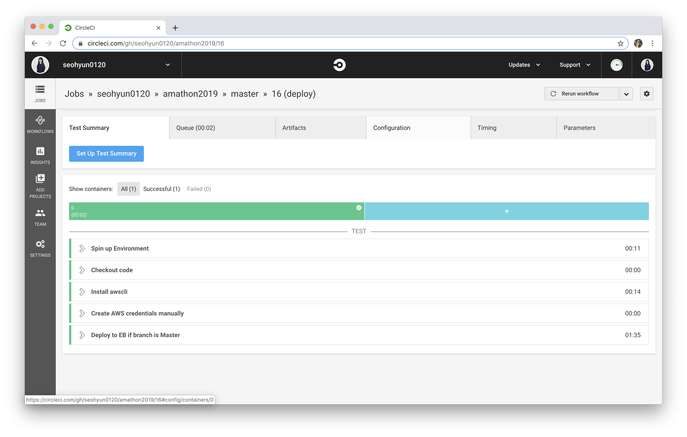

다음과 같이 **success**를 확인할 수 있습니다. 

> 만약 **The EB CLI cannot find a default region. Run "eb init" or use a specific region by including the "--region" option with the command.** 과 같은 에러가 났다면, .gitignore 파일에서 .elasticbeanstalk이 있는지 확인 후 지워주세요. 다시 commit해보면 위와 같이 success를 볼 수 있습니다. 


aws console로 접속해, 제대로 배포가 되었는지 확인해봅시다. Health Green으로 확인되었으니, URL을 접속해보세요. 

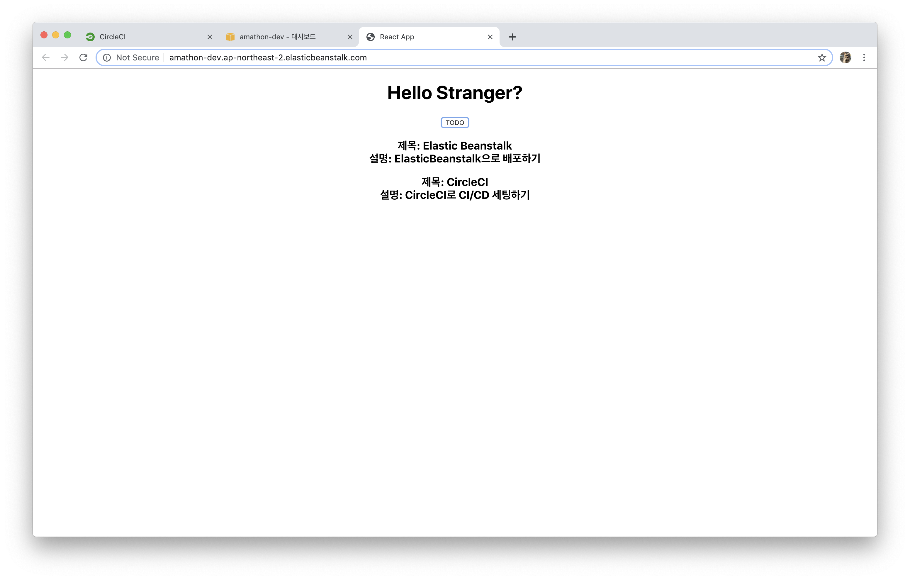

**502 bad gateway** 문제도 해결된 것을 확인할 수 있습니다. 