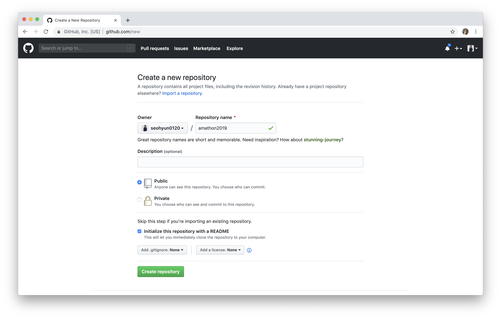
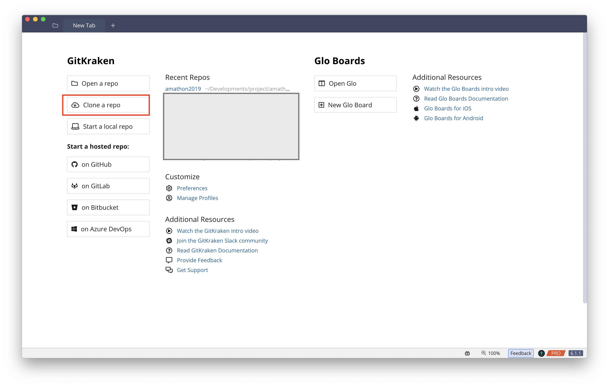
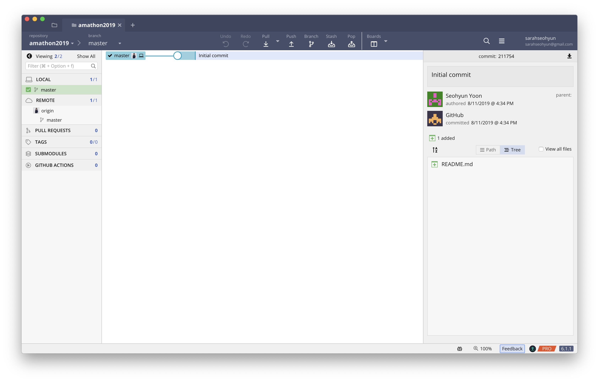

# Git with Gitkraken

1. [GitHub 홈 페이지](https://github.com/dashboard)에서 다음 중 하나를 수행합니다.

   - [**Your repositories**]에서 [**New repository**]를 선택합니다.
   - 탐색 모음에서 [**Create new**]를 선택한 후 [**New repository**]를 선택합니다.

   

2. [**Create a new repository**] 페이지에서 다음을 수행합니다.
   - Repository name: amathon2019 (optional)
   - **[Public]**
   - [**Initialize this repository with a README**]
   - **[Create repository]**

위에서 생성한 repository를 각자 사용중인 GUI 툴을 사용해 clone 받아오세요.

**GitKraken에서 clone 받는 방법**

0. github이 연동된 계정으로 로그인해주세요.

1. **Clone a repo**를 클릭해주세요

2. 각자 프로젝트를 진행할 경로를 설정후, 방금 생성한 repository를 선택한 후, **Clone the repo!** 버튼을 눌러주세요.

3. 이제 세션을 시작해볼까요?